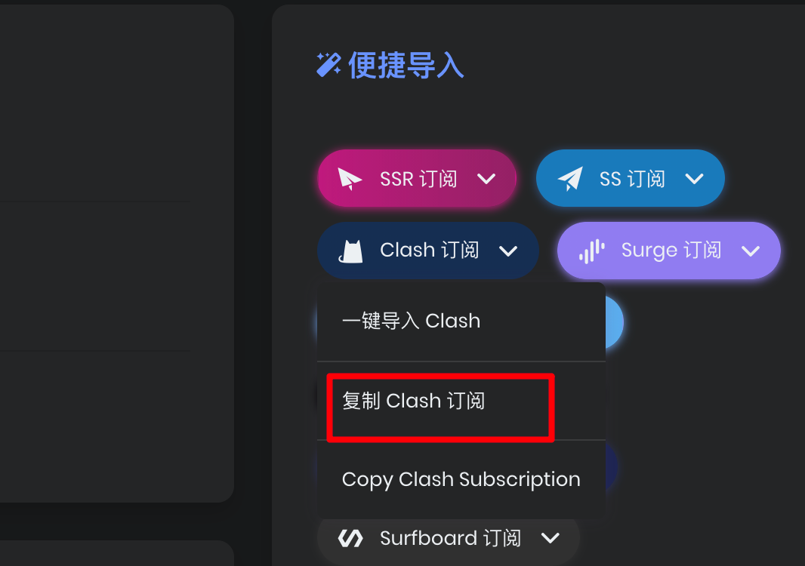

# how-to-INTERNET

how to access the internet elegantly

## 1、需要的软件

软件名，clash，开源免费，支持多协议。

windows：

[Releases · Fndroid/clash_for_windows_pkg (github.com)](https://github.com/Fndroid/clash_for_windows_pkg/releases)

mac：

[Releases · yichengchen/clashX (github.com)](https://github.com/yichengchen/clashX/releases)

linux：

目前没有较为成熟的gui界面，推荐直接使用clash内核：

[Releases · Dreamacro/clash (github.com)](https://github.com/Dreamacro/clash/releases)

安卓：

[Releases · Kr328/ClashForAndroid (github.com)](https://github.com/Kr328/ClashForAndroid/releases)

IOS：

shadowrocket（需要apple ID 美区账号）

## 2、需要💰的地方

上面的是用于科学上网的终端软件，相当于有了工具，但是这时这个工具不知道上哪里去找科学流量。也就是说，这时候你是没有海外服务器来给你的clash提供流量跳板的，这时候就需要购买海外服务器。如果你喜欢折腾，不妨自己试着去搬瓦工购买跨洋专线自己搭建，但是这种方式比较费力而且经常会被查到。

一种比较省心方式是购买一些灰色商家自己搭建的服务器群（即，**机场**）。我这里安利一下我自己用的机场：

https://dogess.work/auth/register?code=LWBZ

注册完成之后需要花钱月租，可以和小伙伴两三个人合租，流量基本用不完。

## 3、配置机场和clash

以博主的机场为例，购买完成之后在用户中心有以下**订阅链接**。上网终端如clash通过访问订阅链接就可以得知海外服务器的IP、端口、协议类型和用户名密码，订阅链接其实就是你购买的机场的服务器的钥匙，一定要妥善保管。

windows电脑配置方法：

在机场的用户中心获取clash订阅链接：

安装完clash之后点击`profile`，在地址栏内输入刚刚获取的订阅链接，然后点击download

就可以看到自己的服务器群的信息。需要注意的是，由于查水表的缘故，经常会有服务器失灵的现象，这时只需要点击一下刷新按钮即可。

紧接着点击proxies就可以调整你的科学上网策略

全局表示所有网站全部经过代理，rule表示部分网站经过代理，我们一般选择全局，即Global模式，点击Global即可配置选择那个服务器节点进行代理

最后点击General，点击开关打开代理，即可完成配置

## 写在最后

如果你有什么问题的话不妨在github仓库的issue页面提出来，或者私信我的电子邮箱：670396323@qq.com

这个页面在之后也会更新（mac、linux和安卓的用法），不妨点个收藏，方便指路（🐶
